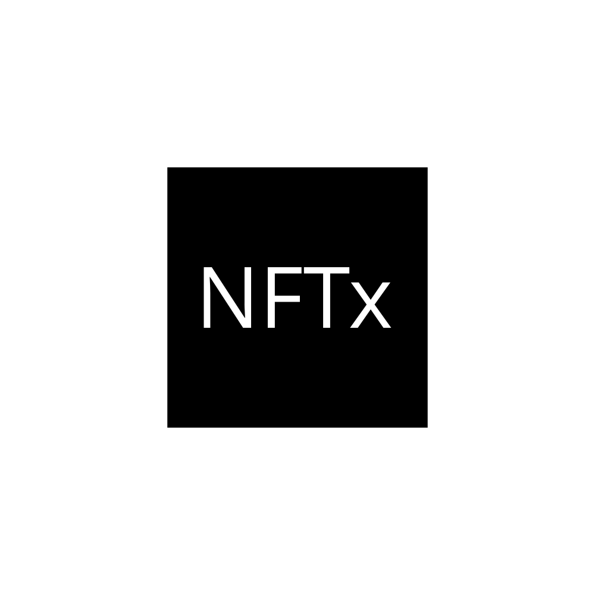

[![Version][version-badge]][version-link]
[![Test CI][ci-badge]][ci-link]
[![Code Coverage][coverage-badge]][coverage-link]
[![License][license-badge]][license-link]
[![Docs][docs-badge]][docs-link]
[![Discussions][discussions-badge]][discussions-link]
[![Discord][discord-badge]][discord-link]

# NFTx Port

NFTx Port is a marketplace protocol for safely and efficiently buying and selling NFTxs.

## Table of Contents

- [NFTxPort](#nftx-port)
  - [Table of Contents](#table-of-contents)
  - [Background](#background)
  - [Deployments](#deployments)
  - [Diagram](#diagram)
  - [Docs](#docs)
  - [Install](#install)
  - [Usage](#usage)
    - [Foundry Tests](#foundry-tests)
    - [Linting](#linting)
  - [Audits](#audits)
  - [Contributing](#contributing)
  - [License](#license)

## Background

/TBI

## Deployments

### Deployments By EVM Chain

<table>
<tr>
<th>Network</th>
<th>Official Release</th>
<th>Beta Release</th>
</tr>
<tr>
<td>Ethereum</td>
<td>Not Deployed</td>
<td>Not Deployed</td>
</tr>
<tr>
<td>Sepolia</td>
<td>Not Deployed</td>
<td>[0xA416416725fF75bf440A91A1cEefE9b7F0c8B046](https://sepolia.etherscan.io/address/0xA416416725fF75bf440A91A1cEefE9b7F0c8B046)</td>
</tr>
</table>

## Diagram

/TBI

## Docs

/TBI

## Install

To install dependencies and compile contracts:

```bash
git clone https://github.com/nftxledger/nftx-port && cd nftx-port
yarn install
yarn build
```

## Usage

To run hardhat tests written in javascript:

```bash
yarn test
yarn coverage
```

> Note: artifacts and cache folders may occasionally need to be removed between standard and coverage test runs.

To profile gas usage:

```bash
yarn profile
```

### Foundry Tests

/TBI

### Linting

To run lint checks:

```bash
yarn lint:check
```

Lint checks utilize prettier, prettier-plugin-solidity, and solhint.

```javascript
"prettier": "^2.5.1",
"prettier-plugin-solidity": "^1.0.0-beta.19",
```

## Audits

NFTx Port is yet to be audited.

## Contributing

Contributions to NFTx Port are welcome by anyone interested in writing more tests, improving readability, optimizing for gas efficiency, or extending the protocol via new zone contracts or other features.

When making a pull request, ensure that:

- All tests pass.
- Code coverage remains at 100% (coverage tests must currently be written in hardhat).
- All new code adheres to the style guide:
  - All lint checks pass.
  - Code is thoroughly commented with natspec where relevant.
- If making a change to the contracts:
  - Gas snapshots are provided and demonstrate an improvement (or an acceptable deficit given other improvements).
  - Reference contracts are modified correspondingly if relevant.
  - New tests (ideally via foundry) are included for all new features or code paths.
- If making a modification to third-party dependencies, `yarn audit` passes.
- A descriptive summary of the PR has been provided.

## License

[MIT](LICENSE) Copyright 2023.

[version-badge]: https://
[version-link]: https://github.com/nftxledger/nftx-port/releases
[ci-badge]: https://
[ci-link]: https://
[coverage-badge]: https://
[coverage-link]: https://
[license-badge]: https://img.shields.io/github/license/nftxledger/nftx-port
[license-link]: https://github.com/nftxledger/nftx-port/blob/main/LICENSE
[docs-badge]: https://
[docs-link]: https://
[discussions-badge]: https://
[discussions-link]: https://
[discord-badge]: https://img.shields.io/static/v1?logo=discord&label=discord&message=Join&color=blue
[discord-link]: https://discord.gg/5235xHYx
